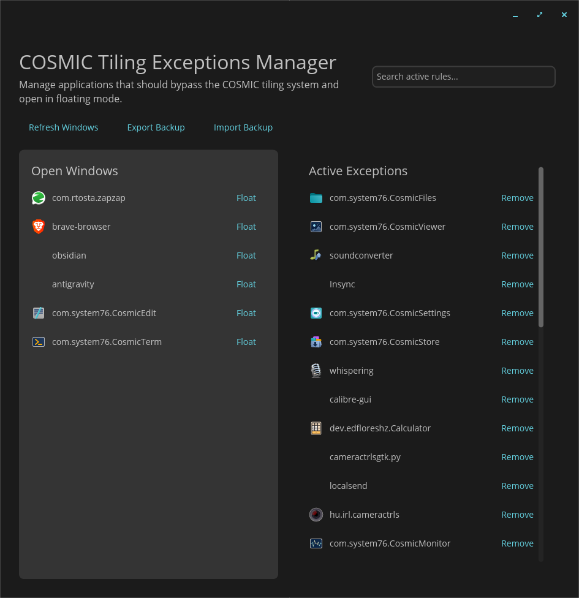

# COSMIC Tiling Exceptions Manager

**COSMIC Tiling Exceptions Manager** is a native GUI utility built with `libcosmic` specifically designed for the COSMIC Desktop Environment (Pop!_OS). It provides an elegant way to manage window auto-tiling exceptions, allowing you to easily configure specific applications to bypass Wayland's auto-tiling mechanism and open in floating mode automatically.



## Features

* **Native COSMIC integration:** Built with the official `libcosmic` library, adhering to the system's design language, themes (dark/light), and aesthetics.
* **Live Window Detection:** Instantly fetches all currently open windows and their `app_id`s, removing the guesswork of finding the correct identifier for an application.
* **One-Click Exceptions:** Transform any open window into a floating exception with a single click.
* **Search & Filter:** Easily find active rules in your exceptions list using the built-in search bar.
* **Backup Management:** Export and import your entire list of rules (`.ron` format) to easily sync your workspace settings across multiple machines.

---

## Requirements

To fetch open windows dynamically, this application communicates with the COSMIC Compositor via the `cosmic-ext-window-helper` script.

### 1. Install `cosmic-ext-window-helper`
You must install the helper script via `pipx` before using this application:
```bash
sudo apt update
sudo apt install pipx
pipx install cosmic-ext-window-helper
pipx ensurepath
```

*(Note: You might need to restart your terminal or log out/in for the pipx path to be recognized globally).*

---

## Installation

Go to the [Releases](https://github.com/maugustolo/cosmic-tiling-manager/releases) page and download the installer that matches your system:

### Debian / Ubuntu / Pop!_OS (`.deb`)
```bash
sudo apt install ./cosmic-tiling-manager_*.deb
```

### Fedora (`.rpm`)
```bash
sudo dnf install ./cosmic-tiling-manager_*.rpm
```

### Universal (`.AppImage`)
Simply make it executable and run:
```bash
chmod +x cosmic-tiling-manager-x86_64.AppImage
./cosmic-tiling-manager-x86_64.AppImage
```

---

## How to Use

### Adding an Exception (Making an app float)
1. Open the application you want to make floating (e.g., Calculator, System Settings).
2. Open the **COSMIC Tiling Exceptions Manager**.
3. Click the **Refresh Windows** button to load all currently active windows on the left panel ("Open Windows").
4. Find the application in the list and click **Float**.
5. It will immediately be moved to the "Active Exceptions" column on the right. The next time you open this app, it will bypass tiling and float!

### Removing an Exception
To make an application tile normally again, simply find it in the "Active Exceptions" column and click **Remove**.

### Exporting and Importing Backups
If you have a complex set of rules and want to back them up or share them with another machine:
1. Click **Export Backup**. A native file dialog will open.
2. Choose where to save your `.ron` (Rust Object Notation) configuration file.
3. To restore them later, click **Import Backup** and select your saved `.ron` file. Your exceptions will be instantly loaded and applied!

---

## 🏗️ Building from source

Ensure you have Rust and the COSMIC development libraries installed (Wayland, xkbcommon).
```bash
git clone https://github.com/maugustolo/cosmic-tiling-manager.git
cd cosmic-tiling-manager
cargo build --release
```
